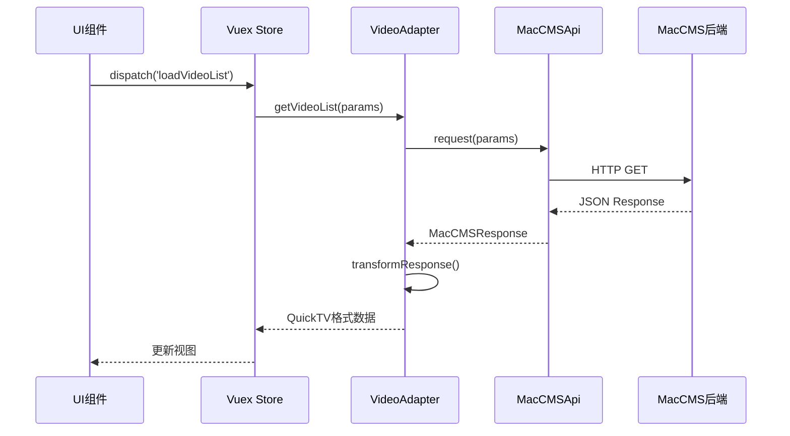
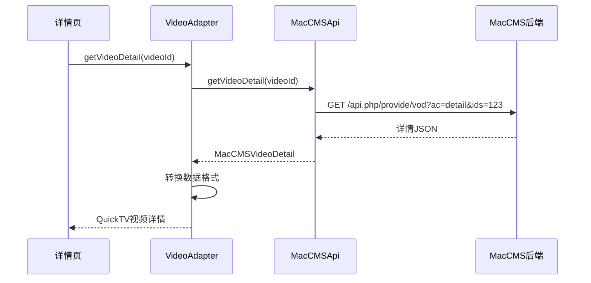
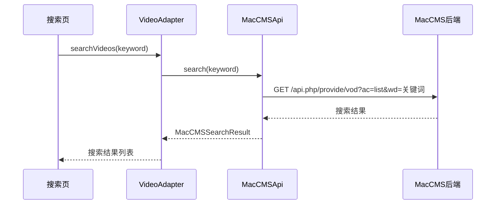

# MacCMS 对接指南

本文档详细说明如何将 QuickTV 应用与 MacCMS（苹果CMS）后端系统对接。

## 目录

- [快速开始](#快速开始)
- [环境配置](#环境配置)
- [MacCMS API 说明](#maccms-api-说明)
- [适配器架构](#适配器架构)
- [数据流程](#数据流程)
- [常见问题](#常见问题)

---

## 快速开始

### 1. 配置 MacCMS API 地址

复制环境配置模板：

```bash
cp .env.example .env.local
```

编辑 `.env.local` 文件，配置你的 MacCMS API 地址：

```env
# MacCMS API 配置
VITE_MACCMS_API_URL=http://your-maccms-domain.com/api.php/provide/vod
VITE_MACCMS_TIMEOUT=10000

# 是否使用模拟数据（开发时可设为 true）
VITE_USE_MOCK_DATA=false
```

### 2. 验证 MacCMS API

确保你的 MacCMS 后端已启用 API 接口：

```bash
# 测试 API 是否可访问
curl "http://your-maccms-domain.com/api.php/provide/vod?ac=list"
```

预期返回 JSON 格式的视频列表数据。

### 3. 启动开发服务器

```bash
npm run dev
```

应用将自动使用配置的 MacCMS API 地址获取数据。

---

## 环境配置

### 环境变量说明

| 变量名 | 说明 | 默认值 | 必填 |
|--------|------|--------|------|
| `VITE_MACCMS_API_URL` | MacCMS API 基础地址 | `http://mockapi.quicktv.net/api` | 是 |
| `VITE_MACCMS_TIMEOUT` | API 请求超时时间（毫秒） | `10000` | 否 |
| `VITE_USE_MOCK_DATA` | 是否使用模拟数据 | `false` | 否 |
| `VITE_DEBUG_MODE` | 是否开启调试模式 | `true` | 否 |

### 多环境配置

项目支持多环境配置：

- `.env.development` - 开发环境
- `.env.production` - 生产环境
- `.env.local` - 本地环境（优先级最高，不会提交到 Git）

---

## MacCMS API 说明

### API 端点

MacCMS 标准 API 端点：

```
http://your-domain.com/api.php/provide/vod
```

### 请求参数

#### 获取视频列表

```
GET /api.php/provide/vod?ac=list&t={分类ID}&pg={页码}&wd={关键词}
```

**参数说明：**

| 参数 | 说明 | 示例 |
|------|------|------|
| `ac` | 操作类型（list/detail/videolist） | `list` |
| `t` | 分类ID | `1` |
| `pg` | 页码 | `1` |
| `wd` | 搜索关键词 | `战狼` |
| `h` | 时间范围（24小时内） | `24` |

#### 获取视频详情

```
GET /api.php/provide/vod?ac=detail&ids={视频ID}
```

**参数说明：**

| 参数 | 说明 | 示例 |
|------|------|------|
| `ac` | 操作类型 | `detail` |
| `ids` | 视频ID（多个用逗号分隔） | `1,2,3` |

### 响应格式

#### 标准响应结构

```json
{
  "code": 1,
  "msg": "数据列表",
  "page": 1,
  "pagecount": 100,
  "limit": "20",
  "total": 2000,
  "list": [
    {
      "vod_id": 1,
      "vod_name": "战狼2",
      "vod_pic": "http://example.com/pic.jpg",
      "vod_remarks": "HD",
      "vod_time": "2023-01-01 12:00:00",
      "type_id": 1,
      "type_name": "动作片",
      "vod_play_url": "播放地址$播放链接"
    }
  ]
}
```

#### 视频详情响应

```json
{
  "code": 1,
  "msg": "数据列表",
  "list": [
    {
      "vod_id": 1,
      "vod_name": "战狼2",
      "vod_pic": "http://example.com/pic.jpg",
      "vod_content": "剧情简介...",
      "vod_actor": "吴京,张翰",
      "vod_director": "吴京",
      "vod_year": "2017",
      "vod_area": "中国大陆",
      "vod_lang": "国语",
      "vod_play_url": "播放地址$播放链接#播放地址2$播放链接2"
    }
  ]
}
```

---

## 适配器架构

### 架构概览

```
src/adapters/maccms/
├── types/              # 类型定义
│   └── index.ts
├── core/               # 核心基类
│   └── base-adapter.ts
├── video/              # 视频适配器
│   └── video-adapter.ts
├── category/           # 分类适配器
│   └── category-adapter.ts
├── api/                # API 客户端
│   └── maccms-api.ts
└── index.ts            # 统一导出
```

### 核心组件

#### 1. MacCMSApi - API 客户端

负责所有 HTTP 请求的发送和响应处理。

```typescript
import { MacCMSApi } from '@/adapters/maccms'

const api = new MacCMSApi({
  baseURL: 'http://your-domain.com/api.php/provide/vod',
  timeout: 10000
})

const videos = await api.getVideoList({ page: 1, pageSize: 20 })
```

#### 2. VideoAdapter - 视频适配器

将 MacCMS 视频数据转换为 QuickTV 内部格式。

```typescript
import { VideoAdapter } from '@/adapters/maccms'

const adapter = new VideoAdapter(api)

const videoList = await adapter.getVideoList({
  categoryId: 1,
  page: 1,
  pageSize: 20
})

const videoDetail = await adapter.getVideoDetail('123')
```

#### 3. CategoryAdapter - 分类适配器

处理视频分类数据。

```typescript
import { CategoryAdapter } from '@/adapters/maccms'

const adapter = new CategoryAdapter(api)
const categories = await adapter.getCategoryList()
```

### 数据转换流程

```
MacCMS API 响应
    ↓
BaseAdapter.transformResponse()
    ↓
具体适配器处理（VideoAdapter/CategoryAdapter）
    ↓
QuickTV 内部数据格式
    ↓
UI 组件渲染
```

---

## 数据流程

### 1. 视频列表加载流程



### 2. 视频详情加载流程



### 3. 搜索流程



---

## 使用示例

### 在组件中使用适配器

```typescript
import { VideoAdapter, MacCMSApi } from '@/adapters/maccms'
import envManager from '@/config/env-manager'

export default {
  async mounted() {
    const api = new MacCMSApi({
      baseURL: envManager.maccmsApiUrl,
      timeout: envManager.maccmsTimeout
    })
    
    const videoAdapter = new VideoAdapter(api)
    
    try {
      const videos = await videoAdapter.getVideoList({
        categoryId: 1,
        page: 1,
        pageSize: 20,
        sort: 'time'
      })
      
      console.log('视频列表:', videos)
    } catch (error) {
      console.error('加载失败:', error)
    }
  }
}
```

### 在 Vuex Store 中使用

```typescript
import { VideoAdapter, MacCMSApi } from '@/adapters/maccms'
import envManager from '@/config/env-manager'

const api = new MacCMSApi({
  baseURL: envManager.maccmsApiUrl,
  timeout: envManager.maccmsTimeout
})

const videoAdapter = new VideoAdapter(api)

export default {
  state: {
    videoList: [],
    loading: false
  },
  
  actions: {
    async loadVideoList({ commit }, params) {
      commit('setLoading', true)
      try {
        const videos = await videoAdapter.getVideoList(params)
        commit('setVideoList', videos)
      } catch (error) {
        console.error('加载视频列表失败:', error)
      } finally {
        commit('setLoading', false)
      }
    }
  },
  
  mutations: {
    setVideoList(state, videos) {
      state.videoList = videos
    },
    setLoading(state, loading) {
      state.loading = loading
    }
  }
}
```

---

## 常见问题

### 1. API 请求失败

**问题：** 请求 MacCMS API 时返回 404 或连接超时

**解决方案：**

1. 检查 `.env.local` 中的 `VITE_MACCMS_API_URL` 是否正确
2. 确认 MacCMS 后端已启用 API 接口
3. 测试 API 是否可访问：`curl "http://your-domain.com/api.php/provide/vod?ac=list"`
4. 检查网络连接和防火墙设置

### 2. 数据格式不匹配

**问题：** MacCMS 返回的数据格式与预期不符

**解决方案：**

1. 检查 MacCMS 版本（建议使用 v10+）
2. 查看 `src/adapters/maccms/types/index.ts` 中的类型定义
3. 根据实际 API 响应调整类型定义
4. 在 `VideoAdapter` 中添加自定义转换逻辑

### 3. 跨域问题

**问题：** 浏览器报 CORS 错误

**解决方案：**

1. 在 MacCMS 后端配置 CORS 允许跨域
2. 使用代理服务器转发请求
3. 在开发环境使用 Vite 代理配置

```typescript
// vite.config.ts
export default {
  server: {
    proxy: {
      '/api': {
        target: 'http://your-maccms-domain.com',
        changeOrigin: true
      }
    }
  }
}
```

### 4. 播放地址解析失败

**问题：** `vod_play_url` 字段格式不正确

**解决方案：**

MacCMS 的播放地址格式为：`播放源$播放地址#播放源2$播放地址2`

需要在适配器中解析：

```typescript
parsePlayUrl(vodPlayUrl: string) {
  const episodes = vodPlayUrl.split('#')
  return episodes.map(episode => {
    const [name, url] = episode.split('$')
    return { name, url }
  })
}
```

### 5. 图片加载失败

**问题：** 视频封面图片无法显示

**解决方案：**

1. 检查 `vod_pic` 字段是否为完整 URL
2. 如果是相对路径，需要拼接域名
3. 在适配器中添加图片 URL 处理逻辑

```typescript
normalizeImageUrl(pic: string, baseUrl: string): string {
  if (pic.startsWith('http')) {
    return pic
  }
  return `${baseUrl}${pic}`
}
```

---

## 进阶配置

### 自定义适配器

如果需要自定义数据转换逻辑，可以继承 `BaseAdapter`：

```typescript
import { BaseAdapter } from '@/adapters/maccms/core/base-adapter'

class CustomVideoAdapter extends BaseAdapter {
  async getCustomData() {
    const response = await this.api.request({
      params: { ac: 'custom' }
    })
    return this.transformResponse(response)
  }
  
  protected transformResponse(data: any) {
    return data
  }
}
```

### 缓存配置

适配器支持缓存功能，可以减少 API 请求：

```typescript
const adapter = new VideoAdapter(api, {
  enableCache: true,
  cacheDuration: 5 * 60 * 1000
})
```

### 错误处理

自定义错误处理逻辑：

```typescript
try {
  const videos = await videoAdapter.getVideoList(params)
} catch (error) {
  if (error.code === 'NETWORK_ERROR') {
    console.error('网络错误')
  } else if (error.code === 'API_ERROR') {
    console.error('API 错误:', error.message)
  }
}
```

---

## 相关文档

- [项目架构文档](./ARCHITECTURE.md)
- [开发指南](./README.md)
- [MacCMS 官方文档](https://www.maccms.la/)

---

## 技术支持

如有问题，请提交 Issue 或联系项目维护者。
